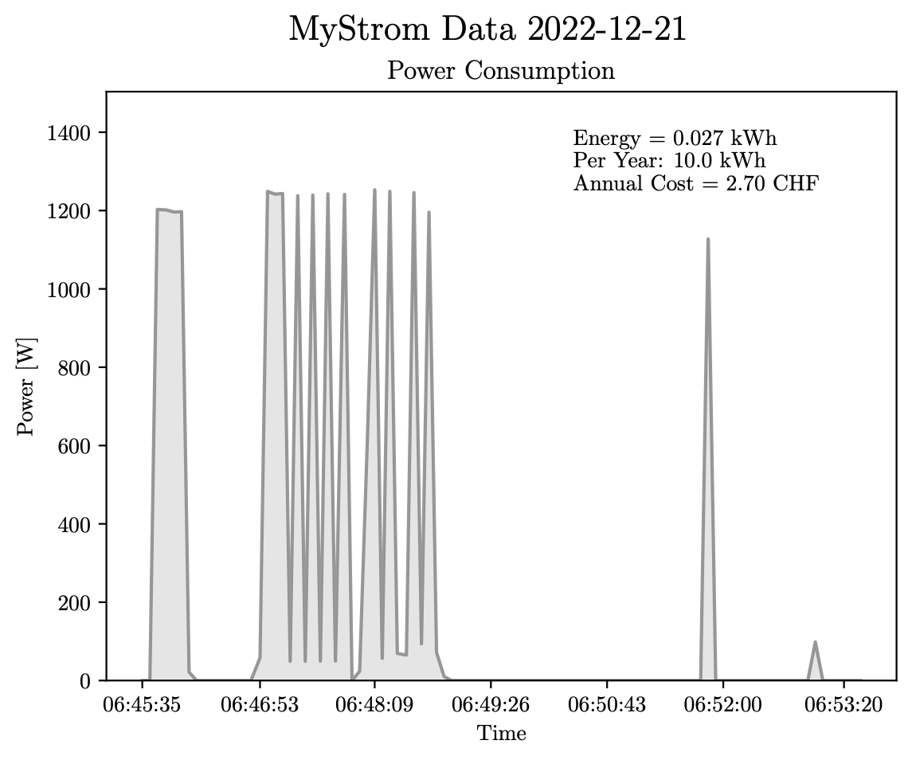

# MyStrom_PowerVisualization

Live plotting of the power consumption of devices plugged into a "MyStrom Smartplug WLAN Energy Control Switch 2".

The following plot for example shows the startup of an espresso machine (if I remember it correctly):

